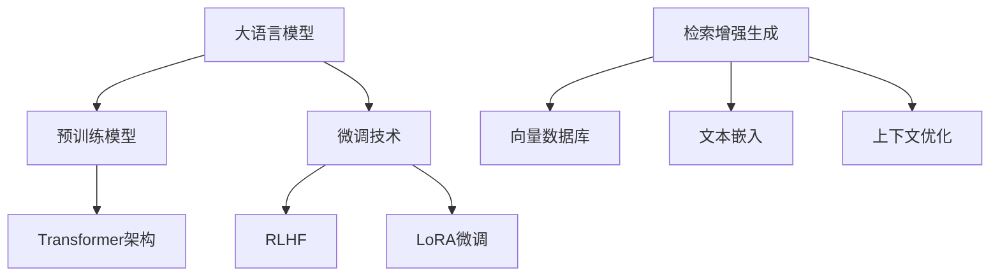

# 🚀 XIK的AI实验室

  
  <h3>专注于大模型与检索增强生成(RAG)的研究与应用</h3>

  
  
  

## 🧠 Transformer架构

  
  
<i>Transformer模型的核心注意力机制架构</i>

## 🔥 核心技术栈

## 📚 主要项目

### [QALite 智能问答笔记系统](https://github.com/yourusername/QAlite)

  
  

**QALite** 是一个轻量级的问答笔记应用，使用Vue 3前端和FastAPI后端，帮助您高效管理和复习知识点。特别适合用于记录AI面试问题、复习知识点、准备大模型微调数据集。

#### ✨ 特点:
- Markdown格式问答记录，多种视图模式
- 智能搜索与复习功能
- 支持导出为大模型训练数据
- 跨平台支持，一键启动

📖 查看更多功能

- 创建和管理Markdown格式的问答笔记
- 编辑、删除和搜索问答对
- 支持分开视图和合并视图模式
- 支持复习模式，帮助记忆和学习
- 自动保存输入内容
- 简洁美观的界面

## 🛠️ 技术专长

### 大语言模型 (LLM)
- 模型训练与调优
- 多模态融合
- RLHF (Reinforcement Learning from Human Feedback)
- 参数高效微调 (LoRA, P-Tuning, Prompt-Tuning)

### 检索增强生成 (RAG)
- 嵌入模型选择与优化
- 向量数据库构建
- 语义检索策略
- 上下文窗口优化

### 应用开发
- LLM应用架构设计
- 前后端分离应用开发
- 高性能API设计
- AI系统部署与监控

## 📊 数据可视化

## 🔗 了解更多

  
  
  

---

    

> 注：请将上面的"yourusername"、链接和图片路径替换为您自己的信息
