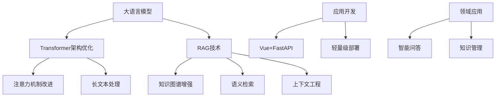

# 🚀 XIK的AI实验室

  <h3>专注于大模型与检索增强生成(RAG)的研究与应用</h3>

  
  
  

## 🔥 核心技术栈

```mermaid
graph TD
    A[大语言模型] --> B[Transformer架构优化]
    A --> C[RAG技术]
    B --> D[注意力机制改进]
    B --> E[长文本处理]
    C --> F[知识图谱增强]
    C --> G[语义检索]
    C --> H[上下文工程]
    I[应用开发] --> J[Vue+FastAPI]
    I --> K[轻量级部署]
    L[领域应用] --> M[智能问答]
    L --> N[知识管理]
```

## 📊 数据可视化

## 🔗 了解更多

  

---

> "AI不是为了替代人类，而是为了增强人类能力，拓展我们的认知边界。"
