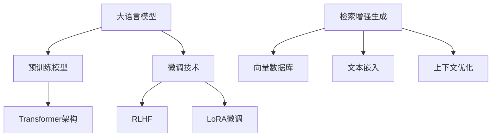

# 🚀 XIK的AI实验室

  
  <h3>专注于大模型与检索增强生成(RAG)的研究与应用</h3>

  
  
  

## 🧠 Transformer架构

  

    <!-- 交互式Transformer架构图 -->
    

      <iframe 
        src="https://transformer-visualizer.vercel.app/" 
        style="position: absolute; top: 0; left: 0; width: 100%; height: 100%; border: none; border-radius: 8px; box-shadow: 0 4px 8px rgba(0,0,0,0.1);"
        allowfullscreen>
      </iframe>
    

    
<i>👆 可拖动交互的Transformer模型架构可视化 (可在框内拖动组件)</i>

  

<b>🔍 点击展开Transformer详细结构说明</b>

### Transformer架构核心组件

1. **输入嵌入 (Input Embedding)**：将输入token转换为向量表示
2. **位置编码 (Positional Encoding)**：为序列中的每个位置添加位置信息
3. **多头注意力机制 (Multi-Head Attention)**：
   - 查询(Query)、键(Key)、值(Value)三个映射矩阵
   - 并行计算多个注意力"头"，捕获不同角度的信息
4. **前馈神经网络 (Feed Forward Network)**：由两个线性变换和ReLU激活函数组成
5. **Add & Norm**：残差连接和层归一化，保证训练稳定性
6. **编码器-解码器结构**：用于序列到序列任务

## 🔥 核心技术栈

## 📚 主要项目

### [AI China Town: 斯坦福小镇中国版](https://github.com/xkj0127/ai_china_town)

  

**AI China Town** 是斯坦福小镇的中国本地化版本，特点包括：
- 使用本地模型部署，无需联网
- 提示工程中文化，适应中文语境
- 简化流程，降低使用门槛
- 优化中文环境下的智能体交互体验

### [QALite: 智能问答笔记系统](https://github.com/xkj0127/QAlite)

  
  

**QALite** 是一个轻量级的问答笔记应用，使用Vue 3前端和FastAPI后端，帮助您高效管理和复习知识点。特别适合用于记录AI面试问题、复习知识点、准备大模型微调数据集。

#### ✨ 特点:
- Markdown格式问答记录，多种视图模式
- 智能搜索与复习功能
- 支持导出为大模型训练数据
- 跨平台支持，一键启动

### [KnowledgeMapNotes: 知识图谱笔记系统](https://github.com/xkj0127/KnowledgeMapNotes)

  

**KnowledgeMapNotes** 是一个基于知识图谱的笔记系统，帮助用户以图谱形式组织和管理知识点，实现知识间关联的可视化展示与导航。

#### ✨ 特点:
- 知识点节点化，支持多维关联
- 智能关联推荐，自动建立知识间联系
- 直观的图形界面，拖拽式编辑
- 支持导出为多种格式

### [AI_NOTE: 个人知识支持图谱](https://github.com/xkj0127/AI_NOTE)

**AI_NOTE** 是一个便携式的个人知识管理系统，将AI与知识图谱技术相结合，为用户构建个性化的知识支持网络。

#### ✨ 特点:
- 自动从文档中提取核心概念并构建知识图谱
- 智能检索与推荐相关知识点
- 与大语言模型集成，提供上下文增强的问答
- 个人记忆扩展，辅助学习与工作

## 🛠️ 技术专长

### 大语言模型 (LLM)
- 模型训练与调优
- 多模态融合
- RLHF (Reinforcement Learning from Human Feedback)
- 参数高效微调 (LoRA, P-Tuning, Prompt-Tuning)

### 检索增强生成 (RAG)
- 嵌入模型选择与优化
- 向量数据库构建 (Milvus, Pinecone, Faiss)
- 语义检索策略优化
- 上下文窗口与长文本处理

### 应用开发
- LLM应用架构设计
- 前后端分离应用开发 (Vue, FastAPI)
- 高性能API设计
- AI系统部署与监控

## 📊 数据可视化

## 🔗 了解更多

  

---

    

> "AI不是为了替代人类，而是为了增强人类能力，拓展我们的认知边界。"
