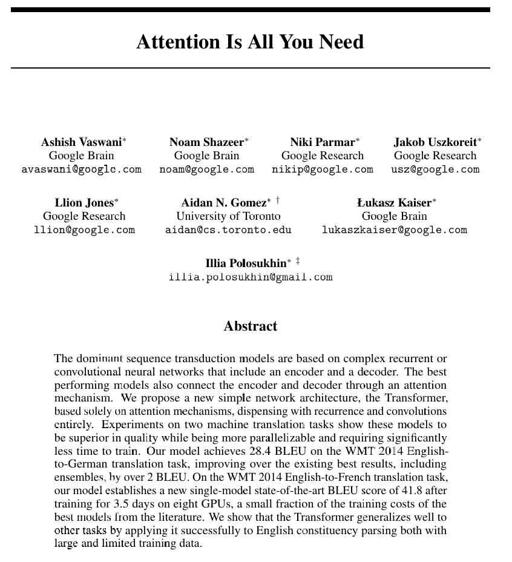
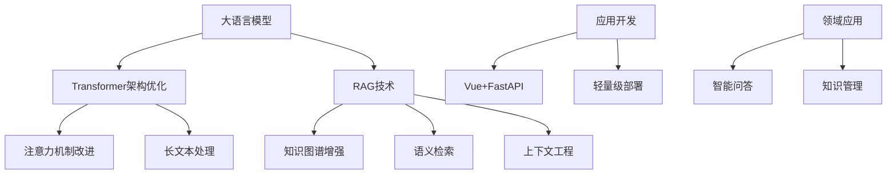

# 🚀 XIK的AI实验室

  <h3>专注于大模型与检索增强生成(RAG)的研究与应用</h3>

  
  
  

## 🧠 Transformer架构

<i>👆 "Attention Is All You Need" - Transformer架构奠基论文</i>

<b>🔍 点击展开Transformer详细结构说明</b>

### Transformer架构核心组件

1. **输入嵌入 (Input Embedding)**：将输入token转换为向量表示
2. **位置编码 (Positional Encoding)**：为序列中的每个位置添加位置信息
3. **多头注意力机制 (Multi-Head Attention)**：
   - 查询(Query)、键(Key)、值(Value)三个映射矩阵
   - 并行计算多个注意力"头"，捕获不同角度的信息
4. **前馈神经网络 (Feed Forward Network)**：由两个线性变换和ReLU激活函数组成
5. **Add & Norm**：残差连接和层归一化，保证训练稳定性
6. **编码器-解码器结构**：用于序列到序列任务

## 🔥 核心技术栈

## 📊 数据可视化

## 🔗 了解更多

  

---

> "AI不是为了替代人类，而是为了增强人类能力，拓展我们的认知边界。"
